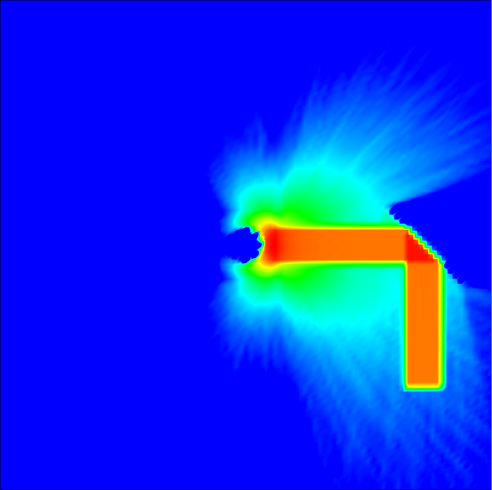

# mcrt
Monte Carlo Radiative Transfer tool

<!-- [](https://docs.rs/mcrt) -->
[](https://crates.io/crates/mcrt)
[](https://freddywordingham.github.io/mcrt/)
[](https://www.rust-lang.org/)
[](https://travis-ci.org/FreddyWordingham/arctk)

Input is the parameters file.
Example parameters.json5:
```json5
{
    tree    : { Here    : {                                                     // Use these tree settings.
        tar_tris    : 5,                                                        // Target num triangles per leaf cell.
        max_depth   : 6,                                                        // Maximum tree splitting depth.
        padding     : 0.01,                                                     // Fraction to increase leaf cells dimensions during detection.
    }},
    grid    : { Here    : {                                                     // Use these grid settings.
        boundary: {                                                             // Grid bounds.
            mins: [-10, -10, -10],                                              // Minimum bound.
            maxs: [ 10,  10,  10],                                              // Maximum bound.
        },
        res: [64, 64, 64],                                                      // Grid resolution.
    } },
    sett    : { Here    : {                                                     // Use these simulation settings.
        num_phot            : 1e6,                                              // Number of photons to simulate.
        block_size          : 1e2,                                              // Photons to simulate per block.
        bump_dist           : 1e-6,                                             // Bump distance.
        loop_limit          : 1e6,                                              // Maximum number of events before culling.
        min_weight          : 5e-2,                                             // Minimum simulation weight.
        roulette_barrels    : 8,                                                // Roulette survival fraction.
        init_mat            : 'air',                                            // Emission material.
    } },
    engine  : "Basic",                                                          // Operation engine selection.
    light   : { Here    : {                                                     // Use these light settings.
        power       : 1.0,                                                      // Power [watts].
        emit        : { Surface: [['objs/light.obj'], null] },                  // Emit from a mesh surface - no transformations.
        spec        : { Here: {Point: 6.3e-7}},                                 // Use this laser spectrum (630nm).
    } },
    mats    : { Here    : {                                                     // Use this material map.
        air : { There   : 'mats/air.json5' },                                   // Air properties there.
        fog : { There   : 'mats/fog.json5' },                                   // Fog properties there.
    } },
    attrs   : { Here    : {                                                     // Use these attributes.
        mirr    : { Mirror: 0.99 },                                             // 99% reflective mirror.
        fog     : { Refractive: ['air', 'fog'] },                               // Interface between air and fog.
    } },
    surfs   : { Here    : {                                                     // Use these surfaces.
            centrepiece : {
                mesh    : [["objs/cube.obj"], {scale: 1.1} ],                   // Use this surface - scale it up 10%.
                attr    : 'fog',                                                // Make it an interface.
            },
            mirror      : {
                mesh    : [["objs/mirrors.obj"], null],                         // Use this surface - no transformations.
                attr    : 'mirr',                                               // Make it reflective.
            }
    } },
}
```

Output in the form of netcdf datacubes.
Example energy density of the above input:

